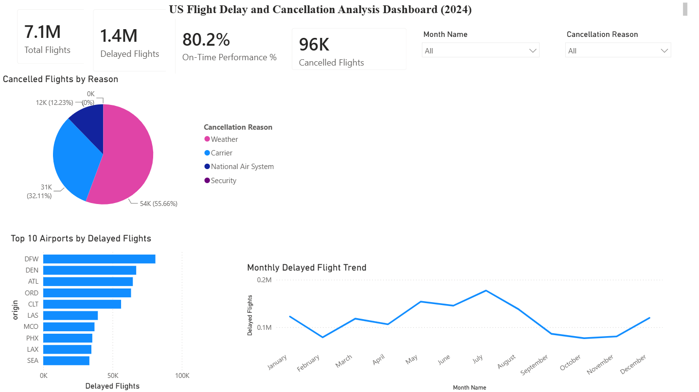
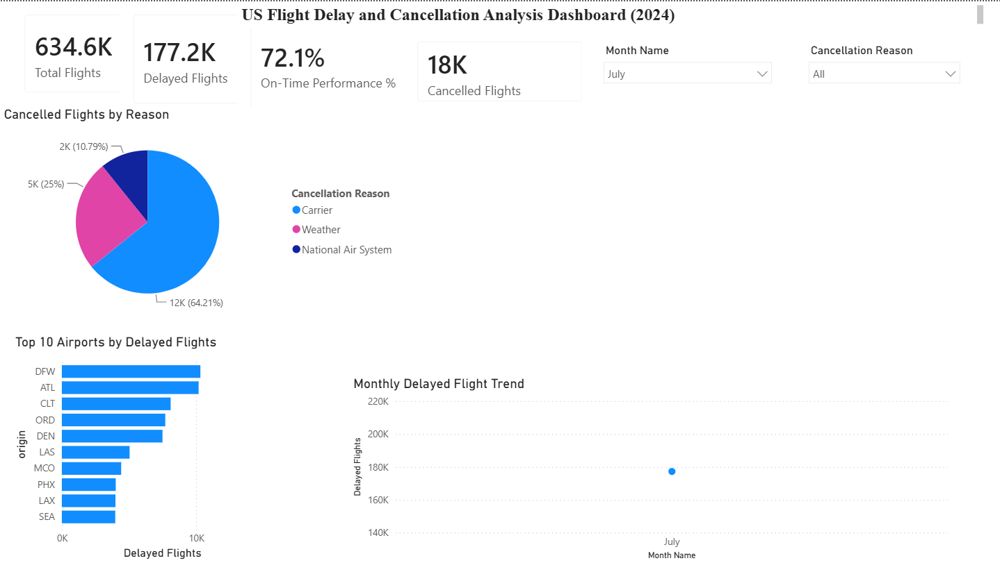
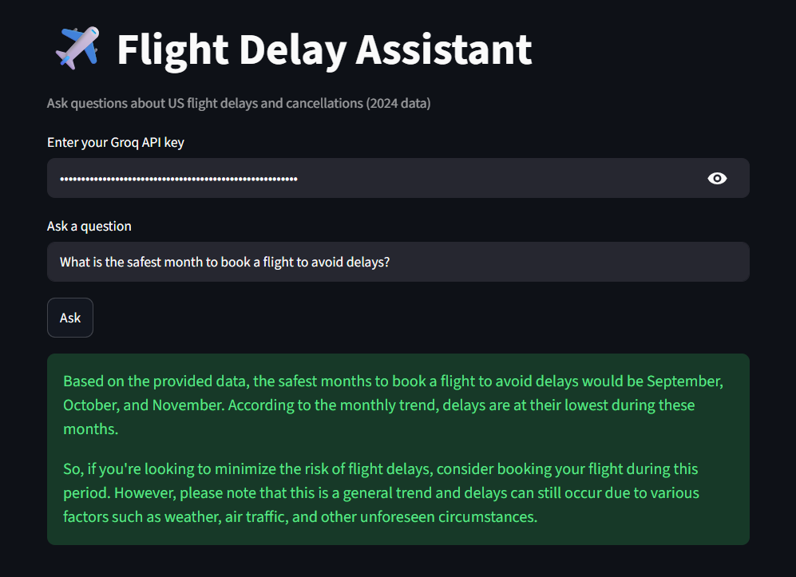

# Flight Delay AI Analytics

## Project Overview

This project analyzes over 7 million US domestic flight records from 2024 to identify patterns in flight delays and cancellations.

The dashboard was built using Power BI and enhanced with an AI-powered aviation assistant built using Streamlit and LLaMA 3.3 via the Groq API.

The goal of this project is to demonstrate data cleaning, transformation, KPI development, dashboard design, DAX calculations, and AI integration for business intelligence.

---

## Business Objectives

- Analyze flight delay trends across the year
- Identify airports with the highest delay volumes
- Understand major causes of flight cancellations
- Measure overall airline operational performance
- Enable natural-language querying through AI

---

## Tools Used

- Power BI
- Power Query
- DAX
- Python
- Streamlit
- Groq API
- LLaMA 3.3 70B

---

## Key KPIs

- Total Flights
- Delayed Flights
- Cancelled Flights
- On-Time Performance %

---

## Dashboard Overview

---

## Dashboard with Interactive Filtering

---

## AI Aviation Assistant

The project includes a Streamlit-based AI assistant that allows users to ask natural language questions about flight operations and receive contextual answers based on dashboard insights.

Example questions:

- Which airport experienced the most delays?
- What month had the highest delay volume?
- What is the main cause of cancellations?
- Why are delays higher during summer months?

---

## Key Insights

- Over 7.1 million flights were analyzed.
- Approximately 1.4 million flights experienced delays.
- On-time performance was approximately 80%.
- Weather was the leading cause of flight cancellations.
- Delay volume peaked during the summer months.
- DFW, DEN, and ATL recorded the highest delay counts.

---

## Author

Mohammad Muneeb Zubair

Computer Science (Data Analytics) Student

Asia Pacific University (APU)
